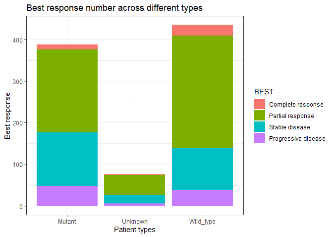

<!-- README.md is generated from README.Rmd. Please edit that file -->

# bis620.2023.final

<!-- badges: start -->

[](https://github.com/kaneplusplus/bis620.2023/actions/workflows/R-CMD-check.yaml)
<!-- badges: end -->

## Installation

You can install the development version of bis620.2023 from
[GitHub](https://github.com/) with:

``` r
# install.packages("devtools")
devtools::install_github("yywwwyy/bis620.2023.final")
#> Downloading GitHub repo yywwwyy/bis620.2023.final@HEAD
#> rlang (1.1.1 -> 1.1.2) [CRAN]
#> Installing 1 packages: rlang
#> Installing package into 'C:/Users/12862/AppData/Local/R/win-library/4.3'
#> (as 'lib' is unspecified)
#> package 'rlang' successfully unpacked and MD5 sums checked
#> Warning: cannot remove prior installation of package 'rlang'
#> Warning in file.copy(savedcopy, lib, recursive = TRUE): problem copying
#> C:\Users\12862\AppData\Local\R\win-library\4.3\00LOCK\rlang\libs\x64\rlang.dll
#> to C:\Users\12862\AppData\Local\R\win-library\4.3\rlang\libs\x64\rlang.dll:
#> Permission denied
#> Warning: restored 'rlang'
#> 
#> The downloaded binary packages are in
#>  C:\Users\12862\AppData\Local\Temp\RtmpE9iYWA\downloaded_packages
#> ── R CMD build ─────────────────────────────────────────────────────────────────
#>          checking for file 'C:\Users\12862\AppData\Local\Temp\RtmpE9iYWA\remotesbe744d291168\yywwwyy-bis620.2023.final-ddd846a/DESCRIPTION' ...     checking for file 'C:\Users\12862\AppData\Local\Temp\RtmpE9iYWA\remotesbe744d291168\yywwwyy-bis620.2023.final-ddd846a/DESCRIPTION' ...   ✔  checking for file 'C:\Users\12862\AppData\Local\Temp\RtmpE9iYWA\remotesbe744d291168\yywwwyy-bis620.2023.final-ddd846a/DESCRIPTION'
#>       ─  preparing 'bis620.2023.final': (477ms)
#>    checking DESCRIPTION meta-information ...  ✔  checking DESCRIPTION meta-information
#>       ─  checking for LF line-endings in source and make files and shell scripts
#>   ─  checking for empty or unneeded directories
#>       ─  building 'bis620.2023.final_0.1.0.tar.gz'
#>      
#> 
#> Installing package into 'C:/Users/12862/AppData/Local/R/win-library/4.3'
#> (as 'lib' is unspecified)
```

## Example

This is a basic example which shows you how to get the cleaned data set
and do plot.

``` r
library(bis620.2023.final)
head(gen_data())
#>      TYPE                 ATRT    SEX AGE B_WEIGHT B_HEIGHT               RACE
#> 1 Unknown         FOLFOX alone   Male  64     64.2      167 White or Caucasian
#> 2  Mutant Panitumumab + FOLFOX   Male  65     67.0      165 White or Caucasian
#> 3  Mutant         FOLFOX alone   Male  60     75.0      175 White or Caucasian
#> 4  Mutant         FOLFOX alone Female  64     52.0      160 White or Caucasian
#> 5 Unknown         FOLFOX alone   Male  74     66.0      171 White or Caucasian
#> 6  Mutant Panitumumab + FOLFOX Female  52     53.0      160 Hispanic or Latino
#>                  BEST
#> 1      Stable disease
#> 2 Progressive disease
#> 3      Stable disease
#> 4    Partial response
#> 5 Progressive disease
#> 6    Partial response
type_plot(gen_data())
```

 \## Abstract
of our research

Our research aims to employ logistic regression analysis to examine the
predictive value of mutation type, treatment type, sex, age, weight,
height, and race on the response to treatment in mCRC. The significance
of these predictors will be assessed through p-values, providing
insights into their relative importance and guiding future personalized
treatment strategies.

## Vignette

You can read the statistical report from the vignette of this package.
The vignette is under the name of abstract-vignette.html in the main
folder. You need to open it in a browser.
